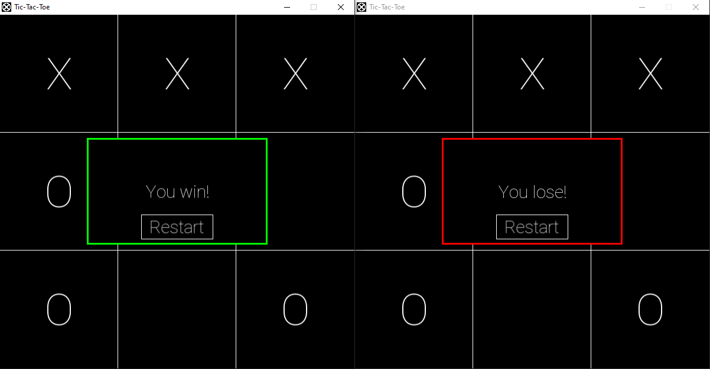

# Tic-Tac-Toe
A multiplayer Tic-Tac-Toe game using [SFML](https://www.sfml-dev.org/). Host or join a game with your friends.



## Building
1. Download the latest version of [SFML](https://www.sfml-dev.org/download.php). Make sure to download the right SFML version for your system.
2. Clone this repo
```
$ git clone https://github.com/ChrisRzech/TicTacToe.git
```
3. Edit the `SFML_DIR` variable in the `makefile` to the location where SFML is on your system.
4. Build
```
$ make
```
5. Run
```
$ make run
```